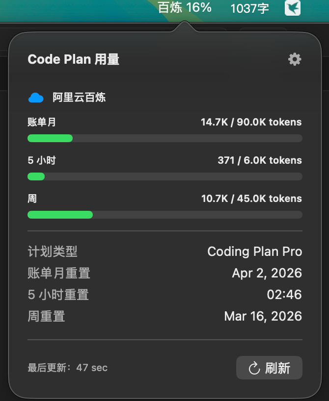

# CodeBar

一个 macOS 菜单栏应用，用于实时监控阿里云百炼 Code Plan 的用量。

## 功能特性

- 菜单栏实时显示 Code Plan 用量百分比
- 支持多个周期用量查看（账单周期、5 小时周期、周周期）
- 低用量时发出提醒
- 自动刷新（每 60 秒，带随机 jitter 避免风控）
- 多选显示类型时每 5 秒滚动展示
- 本地存储认证凭据

## 截图



## 系统要求

- macOS 13.0+
- Xcode 15.0+

## 安装

### 从源码构建

1. 克隆项目：
```bash
git clone git@github.com:wayyoungboy/code_bar.git
cd code_bar
```

2. 使用一键打包脚本（推荐）:
```bash
./build.sh
```
脚本会自动询问是否创建 DMG 安装包，输入 `y` 即可生成 `CodeBar.dmg` 文件。

3. 或直接创建 DMG（如果已构建 App）:
```bash
./create_dmg.sh
```

4. 或使用 Xcode:
```bash
open CodeBar.xcodeproj
# 然后 Product → Archive
```

5. 安装:
- **DMG 方式**: 双击打开 `CodeBar.dmg`，将 `CodeBar` 拖到 `Applications` 文件夹
- **App 方式**: 将 `CodeBar.app` 拖到 `/Applications/` 目录

## 使用方法

### 首次配置

1. 运行应用后，点击菜单栏的 "CodeBar" 图标
2. 点击设置按钮（齿轮图标）
3. 配置百炼凭据

### 获取百炼凭据

1. **登录百炼控制台**
   - 访问 https://bailian.console.aliyun.com/ 并登录

2. **打开开发者工具**
   - 按 F12 或右键点击页面选择「检查」

3. **进入 Network 标签**
   - 在开发者工具中点击 Network 标签

4. **访问 Coding Plan 页面**
   - 在百炼控制台进入 Coding Plan 页面

5. **找到 api.json 请求**
   - 在 Network 列表中找到 api.json 请求

6. **复制凭据**
   - 在请求头中复制 Cookie 和 sec_token

### 配置凭据

在设置界面中填入：
- **Cookie**: 从浏览器复制的完整 Cookie 字符串
- **Sec Token**: 从请求中复制的 sec_token 值
- **区域**: 选择您的区域（如 cn-beijing、cn-hangzhou 等）

## 项目结构

```
code_bar/
├── CodeBar/
│   ├── CodeBarApp.swift          # 应用入口
│   ├── MenuBarView.swift         # 菜单栏 UI 和设置界面
│   ├── UsageTracker.swift        # 用量追踪器
│   └── Providers/
│       ├── PlatformProvider.swift# 平台协议定义
│       └── BailianProvider.swift # 百炼 API 提供者
├── dev_doc/                       # 开发文档（未提交到仓库）
└── README.md                      # 本文件
```

## 开发

### 添加新平台

1. 在 `PlatformType` 枚举中添加新平台
2. 创建新的 Provider 实现 `PlatformProvider` 协议
3. 在 `UsageTracker` 中注册新的 Provider

### 调试

- 查看控制台输出获取错误信息
- 检查凭据是否有效
- 验证网络连接

## 安全性

- 所有凭据存储在 UserDefaults（本地）
- 不会上传或分享任何凭据信息
- 仅用于本地 API 请求

## 许可证

MIT License - 详见 [LICENSE](LICENSE)

## 贡献

欢迎提交 Issue 和 Pull Request！

## 致谢

感谢阿里云百炼提供的 Code Plan 服务
