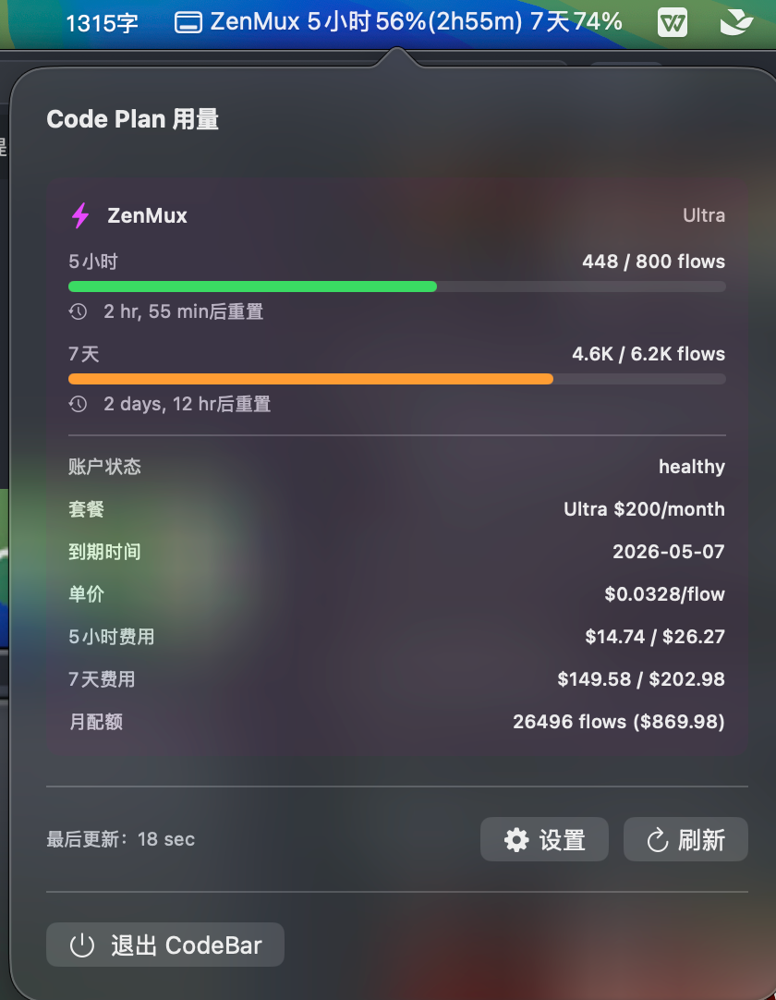

# CodeBar

一个 macOS 菜单栏应用，用于实时监控 AI Coding 平台的用量。

## 支持平台

- **阿里云百炼** — 监控 Coding Plan 用量（账单月、5 小时、周）
- **ZenMux** — 监控 Flow 用量（5 小时、7 天），含订阅详情和费用信息

想支持更多平台？欢迎提交 PR！

## 功能特性

- 菜单栏实时显示多平台用量百分比
- 弹窗自适应大小，完整展示各平台详细信息
- 每个配额周期可独立选择是否展示在菜单栏
- 每个配额周期可独立选择是否展示剩余重置时间
- 每个平台可独立启用/禁用
- ZenMux 展示完整订阅信息（套餐、费用、单价、到期时间等）
- 低用量时发出提醒
- 多平台自动轮播显示（每 5 秒切换）
- 自动刷新（每 60 秒，带随机 jitter 避免风控）
- 统一 Keychain 存储，启动仅需一次授权

## 截图



## 系统要求

- macOS 13.0+
- Xcode 15.0+

## 安装

### 从源码构建

1. 克隆项目：
```bash
git clone git@github.com:wayyoungboy/code_bar.git
cd code_bar
```

2. 使用一键打包脚本（推荐）:
```bash
./build.sh
```
脚本会自动询问是否创建 DMG 安装包，输入 `y` 即可生成 `CodeBar.dmg` 文件。

3. 或直接创建 DMG（如果已构建 App）:
```bash
./create_dmg.sh
```

4. 或使用 Xcode:
```bash
open CodeBar.xcodeproj
# 然后 Product → Archive
```

5. 安装:
- **DMG 方式**: 双击打开 `CodeBar.dmg`，将 `CodeBar` 拖到 `Applications` 文件夹
- **App 方式**: 将 `CodeBar.app` 拖到 `/Applications/` 目录

### 从 Release 下载

1. 前往 [Releases](https://github.com/wayyoungboy/code_bar/releases) 下载最新 `CodeBar.dmg`
2. 双击打开 DMG，将 CodeBar 拖到 Applications
3. 首次打开如提示"已损坏"或"无法验证开发者"，在终端执行：
```bash
xattr -cr /Applications/CodeBar.app
```
这是因为应用未经 Apple 公证（notarization），属于正常现象。

## 使用方法

### 首次配置

1. 运行应用后，点击菜单栏的 "CodeBar" 图标
2. 点击设置按钮（齿轮图标）
3. 配置您需要的平台凭据（百炼和/或 ZenMux）
4. 勾选需要在菜单栏展示的配额周期和重置时间

### 获取百炼凭据

1. **登录百炼控制台**
   - 访问 https://bailian.console.aliyun.com/ 并登录

2. **打开开发者工具**
   - 按 F12 或右键点击页面选择「检查」

3. **进入 Network 标签**
   - 在开发者工具中点击 Network 标签

4. **访问 Coding Plan 页面**
   - 在百炼控制台进入 Coding Plan 页面

5. **找到 api.json 请求**
   - 在 Network 列表中找到 api.json 请求

6. **复制凭据**
   - 在请求头中复制 Cookie 和 sec_token

### 获取 ZenMux API Key

1. **登录 ZenMux**
   - 访问 [ZenMux 管理页面](https://zenmux.ai/platform/management) 并登录

2. **找到 API Keys 部分**
   - 在管理页面中定位到 API Keys

3. **复制 Management API Key**
   - 必须使用 Management API Key，标准 API Key 不支持

### 配置凭据

#### 阿里云百炼

在设置界面中填入：
- **Cookie**: 从浏览器复制的完整 Cookie 字符串
- **Sec Token**: 从请求中复制的 sec_token 值
- **区域**: 选择您的区域（如 cn-beijing、cn-hangzhou 等）

#### ZenMux

在设置界面中填入：
- **Management API Key**: 从 ZenMux 管理页面复制的 Management API Key
- 仅支持 Management API Key，标准 API Key 无效

## 项目结构

```
code_bar/
├── CodeBar/
│   ├── CodeBarApp.swift          # 应用入口、菜单栏和弹窗管理
│   ├── MenuBarView.swift         # 弹窗 UI（用量卡片、进度条、额外信息）
│   ├── SettingsWindow.swift      # 设置窗口（凭据配置、展示选项、帮助）
│   ├── UsageTracker.swift        # 多平台用量追踪器（配置、刷新、存储）
│   ├── Constants.swift           # 应用常量配置
│   ├── KeychainHelper.swift      # Keychain 安全存储封装
│   ├── AppLogger.swift           # 日志工具
│   └── Providers/
│       ├── PlatformProvider.swift # 平台协议和数据模型（UsageItem、PlatformUsageData）
│       ├── BailianProvider.swift  # 阿里云百炼 API 提供者
│       └── ZenMuxProvider.swift   # ZenMux API 提供者
└── README.md                      # 本文件
```

## 开发

### 添加新平台

1. 在 `PlatformType` 枚举中添加新平台
2. 创建新的 Provider 实现 `PlatformProvider` 协议，返回 `PlatformUsageData`
3. 在 `UsageTracker` 中注册新的 Provider
4. 在 `SettingsWindow` 中添加配置表单

每个 Provider 可自由定义自己的配额项（`UsageItem`）和额外信息（`extraInfo`），UI 会动态渲染。

### 调试

- 查看控制台输出获取错误信息
- 检查凭据是否有效
- 验证网络连接

## 安全性

- 所有平台凭据统一存储在单个 Keychain 条目中，启动仅需一次授权
- 不会上传或分享任何凭据信息
- 仅用于本地 API 请求

## 许可证

MIT License - 详见 [LICENSE](LICENSE)

## 贡献

欢迎提交 Issue 和 Pull Request！

## 致谢

感谢以下平台提供的服务：

- [阿里云百炼](https://bailian.console.aliyun.com/) — Code Plan 用量监控
- [ZenMux](https://zenmux.ai) — AI Coding 平台
