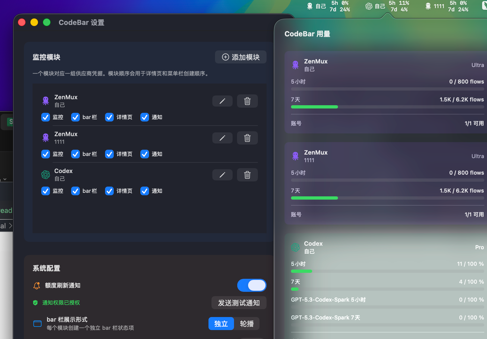

<div align="center">

# CodeBar

**macOS 菜单栏里的 AI Coding 用量雷达。**

[](#系统要求)
[](#开发)
[](https://github.com/wayyoungboy/code_bar/releases)
[](LICENSE)

一个实时监控 AI Coding 平台额度的 macOS 菜单栏应用。把 BaiLian、ZenMux、MiMo、Codex 的用量和重置时间收进菜单栏，适合同时维护多个账号、多个团队额度的人。

</div>



## Highlights

| 能力 | 说明 |
|---|---|
| 多平台监控 | 阿里云百炼、ZenMux、小米 MiMo、Codex |
| 多账号模块 | ZenMux 支持多个账号模块，每个账号独立展示 |
| 菜单栏策略 | 支持独立状态项和轮播状态项两种展示方式 |
| 配额提醒 | 5 小时、7 天、周、月等周期可按模块开启提醒 |
| 安全存储 | CodeBar 自身配置统一写入 macOS Keychain |
| Codex 免配置 | 自动读取本机 Codex CLI OAuth 凭据 |

## Preview

| 多模块监控 | Codex 用量 | 额度刷新通知 |
|---|---|---|
|  |  |  |

## 支持平台

- **阿里云百炼**：监控 Coding Plan 用量（账单月、5 小时、周）
- **ZenMux**：监控 Flow 用量（5 小时、7 天），支持按账号添加独立监控模块
- **小米 MiMo**：监控 Token 用量（月用量、总用量）
- **Codex**：自动读取 Codex CLI 的 ChatGPT OAuth 凭据，查询官方 5 小时 / 7 天订阅额度

想支持更多平台？欢迎提交 PR。

## 功能特性

- 通过「添加模块」逐个添加供应商账号或凭据
- 每个模块可配置别名，方便区分个人、团队或项目账号
- 每个模块可独立选择是否监控、是否显示在菜单栏、是否显示在详情页
- 设置页支持拖动模块排序，详情页和菜单栏按模块顺序展示
- 菜单栏多模块展示支持「独立」和「轮播」两种模式
- 弹窗按模块独立展示用量、套餐、重置时间和额外信息
- 每个模块的配额周期可独立选择是否展示，以及是否展示剩余重置时间
- 自动刷新（每 60 秒，带随机 jitter 避免风控）

## 系统要求

- macOS 13.0+
- Xcode 15.0+

## 安装

### 从 Release 下载

1. 前往 [Releases](https://github.com/wayyoungboy/code_bar/releases) 下载最新 `CodeBar.dmg`
2. 双击打开 DMG，将 CodeBar 拖到 Applications
3. 首次打开时 macOS 可能提示“无法验证开发者”或“已损坏”，这是因为 DMG 未经 Apple 公证，属于正常现象。解决方法：
   - 打开「系统设置 → 隐私与安全性」，拉到最下方，点击「仍要打开」
   - 或在终端执行：
   ```bash
   xattr -cr /Applications/CodeBar.app
   ```

### 从源码构建

```bash
git clone git@github.com:wayyoungboy/code_bar.git
cd code_bar
xcodebuild -project CodeBar.xcodeproj -scheme CodeBar -configuration Debug build
```

也可以使用脚本构建 Release 包：

```bash
./build.sh
```

脚本会询问是否创建 DMG。CI 发布时不依赖本地脚本，推送 `v*` tag 会触发 GitHub Actions 自动构建并上传 `CodeBar.dmg`。

## 使用方法

### 首次配置

1. 运行应用后，点击菜单栏的 CodeBar 图标
2. 点击设置按钮（齿轮图标）
3. 点击「添加模块」，选择供应商并填写该模块需要的凭据
4. 保存后，可在模块列表中切换「监控」「bar栏」「详情页」
5. 拖动模块列表调整展示顺序
6. 进入模块编辑页，勾选需要展示的配额周期和重置时间

### 阿里云百炼

在设置界面点击「添加模块」，选择「阿里云百炼」，填入：

- **Cookie**：从浏览器复制的完整 Cookie 字符串
- **Sec Token**：从请求中复制的 `sec_token` 值
- **区域**：选择 `cn-beijing`、`cn-shanghai`、`cn-shenzhen` 或 `cn-hangzhou`

获取步骤：

1. 登录 https://bailian.console.aliyun.com/
2. 打开开发者工具，切到 Network
3. 进入 Coding Plan 页面
4. 找到 `api.json` 请求
5. 从请求头复制 Cookie 和 `sec_token`

### ZenMux

在设置界面点击「添加模块」，选择「ZenMux」。每个 ZenMux 账号对应一个独立模块，填入：

- **账号别名**：用于区分项目、团队或个人账号
- **Management API Key**：从 ZenMux 管理页面复制的 Management API Key

注意：仅支持 Management API Key，标准 API Key 无效。

每个账号模块可以独立勾选是否展示 5 小时 / 7 天配额，以及是否展示对应重置时间。详情页中每个 ZenMux 账号会作为独立模块展示，不再按平台聚合。

ZenMux 5 小时或 7 天额度周期刷新时，CodeBar 可发送 macOS 系统通知。同一周期内不会重复提醒，设置界面可开关通知并发送测试通知。

### 小米 MiMo

在设置界面点击「添加模块」，选择「小米 MiMo」，填入：

- **Service Token**：浏览器 Cookie 中的 `api-platform_serviceToken`
- **User ID**：浏览器 Cookie 中的 `userId`

获取步骤：

1. 访问 https://platform.xiaomimimo.com/ 并登录
2. 打开开发者工具，切到 Application
3. 在 Cookies 中找到 `platform.xiaomimimo.com`
4. 复制 `api-platform_serviceToken` 和 `userId`

### Codex

在设置界面点击「添加模块」，选择「Codex」。Codex 不需要在 CodeBar 中配置 token，CodeBar 会按以下优先级自动读取本机 Codex CLI 的 ChatGPT OAuth 凭据：

1. 文件：`~/.codex/auth.json`
2. macOS Keychain：`Codex Auth`

为减少 macOS 授权弹窗，Keychain fallback 在每次应用启动后最多读取一次；后续刷新会复用本次读取结果。

要求：

- Codex CLI 已登录 ChatGPT
- `auth_mode` 为 `chatgpt`
- OAuth 凭据中存在 `tokens.access_token`

CodeBar 请求的官方接口：

```text
GET https://chatgpt.com/backend-api/wham/usage
```

请求头与 Codex CLI / cc-switch 对齐：

```text
Authorization: Bearer <access_token>
User-Agent: codex-cli
Accept: application/json
ChatGPT-Account-Id: <account_id>   # 如存在
```

支持展示：

- `plan_type`，例如 `Pro`
- 主 `rate_limit` 的 5 小时 / 7 天窗口
- `additional_rate_limits`
- `credits`
- `spend_control`
- `rate_limit_reset_credits.available_count`

如果直连 `chatgpt.com` 不稳定，可以在 Codex 模块中填写代理地址：

```text
http://127.0.0.1:7890
socks5://127.0.0.1:7890
```

不配置代理时会直接请求，行为与 cc-switch 的默认模式一致。

## 项目结构

```text
code_bar/
├── CodeBar/
│   ├── CodeBarApp.swift           # 应用入口、菜单栏和弹窗管理
│   ├── MenuBarView.swift          # 弹窗 UI（用量卡片、进度条、额外信息）
│   ├── SettingsWindow.swift       # 设置窗口（模块管理、凭据配置、展示选项、帮助）
│   ├── UsageTracker.swift         # 用量追踪器（模块配置、刷新、存储、通知）
│   ├── Constants.swift            # 应用常量配置
│   ├── KeychainHelper.swift       # Keychain 安全存储封装
│   ├── Logger.swift               # 日志工具
│   ├── UpdateChecker.swift        # GitHub Release 更新检查
│   └── Providers/
│       ├── PlatformProvider.swift # 平台协议、数据模型和配置模型
│       ├── BailianProvider.swift  # 阿里云百炼 API Provider
│       ├── ZenMuxProvider.swift   # ZenMux API Provider
│       ├── MimoProvider.swift     # 小米 MiMo API Provider
│       └── CodexProvider.swift    # Codex / ChatGPT OAuth Provider
├── docs/
│   ├── architecture.md
│   ├── developer-guide.md
│   ├── uml-diagrams.md
│   └── codebar-go-design.md       # 历史 Go/Wails 设计草案
├── .github/workflows/release.yml  # tag 发布 workflow
├── build.sh
├── create_dmg.sh
└── README.md
```

## 开发

### 添加新平台

1. 在 `PlatformType` 枚举中添加新平台
2. 创建新的 Provider，实现 `PlatformProvider`
3. 在 `MonitorModuleConfig` 中添加该平台的模块配置 case
4. 在 `UsageTracker.provider(for:)` 中把模块配置映射为 Provider
5. 在 `ModuleEditorView` 中添加凭据表单、展示项和帮助内容

每个 Provider 可自由定义自己的配额项（`UsageItem`）和额外信息（`extraInfo`），UI 会动态渲染。

### 构建验证

```bash
xcodebuild -project CodeBar.xcodeproj -scheme CodeBar -configuration Debug build
xcodebuild -project CodeBar.xcodeproj -scheme CodeBar -configuration Release -derivedDataPath build CODE_SIGN_IDENTITY="" CODE_SIGNING_REQUIRED=NO CODE_SIGNING_ALLOWED=NO build
```

### 发布

1. 更新 `CodeBar/Info.plist` 的 `CFBundleShortVersionString`
2. 提交版本变更
3. 创建并推送 tag：

```bash
git tag -a v2.2.0 -m "CodeBar v2.2.0"
git push origin v2.2.0
```

GitHub Actions 会自动构建 Release、创建 DMG 并上传到 GitHub Release。

## 安全性

- CodeBar 自身配置存储在 macOS Keychain
- Codex OAuth 凭据只从 Codex CLI 已存在的位置读取，不复制 token 到 CodeBar 配置
- 不会上传或分享任何凭据信息
- 日志只记录请求 URL 和状态码，不记录 token、Cookie 或 API Key

## 商标与 Logo

项目中展示的平台 Logo 仅用于标识对应服务，相关商标和 Logo 归各自权利方所有。CodeBar 与阿里云、ZenMux、小米、OpenAI 无官方从属、授权或背书关系。

- ZenMux Logo 来源：[zenmux.ai](https://zenmux.ai/)
- Xiaomi / Mi Logo 来源：[mi.com](https://www.mi.com/)
- OpenAI / ChatGPT Logo 来源：[chatgpt.com/codex](https://chatgpt.com/zh-Hans-CN/codex/)

如相关权利方希望调整或移除展示，请通过 Issue 联系。

## 许可证

MIT License - 详见 [LICENSE](LICENSE)

## 贡献

欢迎提交 Issue 和 Pull Request。

## 致谢

- [阿里云百炼](https://bailian.console.aliyun.com/) — Code Plan 用量监控
- [ZenMux](https://zenmux.ai) — AI Coding 平台
- [小米 MiMo](https://platform.xiaomimimo.com/) — AI 编程平台
- [OpenAI Codex](https://openai.com/codex/) — Codex CLI / ChatGPT OAuth 用量
