# CodeBar 架构文档 (Architecture Document)

> **版本**: 2.0.0 | **框架**: Go + Wails v2 | **作者**: wayyoung
> **日期**: 2026-05-05

---

## 目录

1. [项目概述](#1-项目概述)
2. [技术栈](#2-技术栈)
3. [目录结构](#3-目录结构)
4. [UML 图](#4-uml-图)
   - 4.1 [系统架构图 (C4 Context)](#41-系统架构图)
   - 4.2 [包依赖图 (Package Diagram)](#42-包依赖图)
   - 4.3 [类图 (Class Diagram)](#43-类图)
   - 4.4 [序列图 — 启动流程](#44-序列图--启动流程)
   - 4.5 [序列图 — 数据刷新流程](#45-序列图--数据刷新流程)
   - 4.6 [序列图 — 凭据配置流程](#46-序列图--凭据配置流程)
   - 4.7 [序列图 — 重复实例检测](#47-序列图--重复实例检测)
   - 4.8 [状态图 — 应用生命周期](#48-状态图--应用生命周期)
   - 4.9 [状态图 — Tracker 刷新状态](#49-状态图--tracker-刷新状态)
   - 4.10 [活动图 — Provider FetchUsage](#410-活动图--provider-fetchusage)
   - 4.11 [组件图 — 前端 React 组件](#411-组件图--前端-react-组件)
   - 4.12 [部署图](#412-部署图)
   - 4.13 [数据流图 (Data Flow Diagram)](#413-数据流图)
5. [核心模块详解](#5-核心模块详解)
   - 5.1 [Provider 系统](#51-provider-系统)
   - 5.2 [Config Store](#52-config-store)
   - 5.3 [Tracker](#53-tracker)
   - 5.4 [System Tray](#54-system-tray)
   - 5.5 [Wails 绑定层](#55-wails-绑定层)
   - 5.6 [前端 (React)](#56-前端-react)
6. [安全设计](#6-安全设计)
7. [跨平台适配](#7-跨平台适配)
8. [Provider 一览](#8-provider-一览)
9. [API 参考](#9-api-参考)
10. [构建与运行](#10-构建与运行)

---

## 1. 项目概述

CodeBar 是一个跨平台桌面应用，用于监控多个 AI 平台的 API 用量配额。它运行在系统托盘中，定时轮询各平台 API 获取用量数据，通过 Wails 前端以可视化卡片展示给用户。

### 核心特性

- **19 个 AI 平台** 的用量监控 (ZenMux, Claude, Copilot, Gemini, 百炼 等)
- **系统托盘** 常驻，轮换显示各平台用量百分比
- **跨平台凭据存储** (macOS Keychain / Linux libsecret / Windows DPAPI)
- **定时刷新** (60s + 随机抖动) 带本地磁盘缓存
- **单实例保护** — 检测重复启动并提醒用户
- **LSUIElement** — macOS 上不显示 Dock 图标，纯菜单栏应用

---

## 2. 技术栈

| 层次 | 技术 | 版本 |
|------|------|------|
| **后端语言** | Go | 1.25.5 |
| **桌面框架** | Wails | v2.12.0 |
| **前端框架** | React | 19.2.5 |
| **CSS** | Tailwind CSS | v4.2.4 |
| **构建工具** | Vite | 8.0.10 |
| **TypeScript** | TypeScript | 6.0.2 |
| **系统托盘** | energye/systray | 1.0.3 |
| **macOS Keychain** | keybase/go-keychain | 0.0.1 |
| **Linux D-Bus** | godbus/dbus/v5 | 5.2.2 |
| **UUID** | google/uuid | 1.6.0 |

---

## 3. 目录结构

```
code_bar/
├── main.go                          # Wails 应用入口、App 结构体、菜单
├── wails.json                       # Wails 项目配置
├── go.mod / go.sum                  # Go 模块依赖
├── internal/
│   ├── config/
│   │   ├── store.go                 # Store 接口定义
│   │   ├── store_keychain.go        # macOS Keychain 实现 (//go:build darwin)
│   │   ├── store_libsecret.go       # Linux libsecret 实现 (//go:build linux)
│   │   ├── store_dpapi.go           # Windows DPAPI 实现 (//go:build windows)
│   │   └── store_file.go            # AES-GCM 加密文件回退方案
│   ├── provider/
│   │   ├── provider.go              # PlatformProvider 接口 + 全局注册表
│   │   ├── http.go                  # 共享 HTTP 客户端 + doRequest 辅助函数
│   │   ├── factory.go               # InstantiateProviders + Factory provider
│   │   ├── zenmux.go                # ZenMux provider (真实 API)
│   │   ├── bailian.go               # 阿里云百炼 provider (真实 API)
│   │   ├── claude.go                # Claude provider
│   │   ├── copilot.go               # GitHub Copilot provider
│   │   ├── gemini.go                # Gemini provider
│   │   ├── amp.go                   # Amp provider
│   │   ├── antigravity.go           # Antigravity provider
│   │   ├── codex.go                 # Codex provider
│   │   ├── cursor.go                # Cursor provider
│   │   ├── jetbrains.go             # JetBrains AI provider
│   │   ├── kimi.go                  # Kimi provider
│   │   ├── kiro.go                  # Kiro provider
│   │   ├── minimax.go               # MiniMax provider
│   │   ├── opencode.go              # OpenCode provider
│   │   ├── perplexity.go            # Perplexity provider
│   │   ├── synthetic.go             # Synthetic provider
│   │   ├── windsurf.go              # Windsurf provider
│   │   ├── zai.go                   # Z.ai provider
│   │   └── zenmux_test.go           # ZenMux 集成测试
│   ├── tracker/
│   │   └── tracker.go               # 定时刷新调度、缓存、事件发射
│   └── tray/
│       └── tray.go                  # 系统托盘管理
├── frontend/
│   ├── index.html                   # HTML 入口
│   ├── package.json                 # NPM 依赖
│   ├── vite.config.ts               # Vite 配置
│   ├── tsconfig.json                # TypeScript 配置
│   └── src/
│       ├── main.tsx                 # React 挂载点
│       ├── App.tsx                  # 主应用组件 (~465 行)
│       ├── index.css                # Tailwind CSS 基础样式
│       └── wailsjs/                 # Wails 自动生成的绑定
│           ├── go/main/App.d.ts     # Go App 方法类型声明
│           ├── go/models.ts         # Go 数据结构 TypeScript 映射
│           └── runtime/runtime.d.ts # Wails 运行时 API
├── build/
│   └── darwin/
│       ├── Info.plist               # macOS 应用 plist (含 LSUIElement)
│       └── Info.dev.plist           # 开发模式 plist
└── docs/
    ├── codebar-go-design.md         # 设计规格
    └── architecture.md              # 本文档
```

---

## 4. UML 图

### 4.1 系统架构图

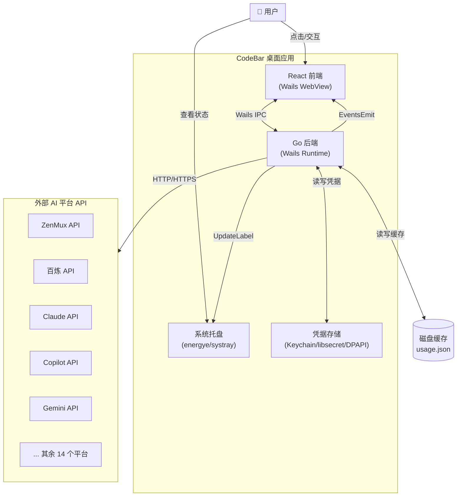

### 4.2 包依赖图

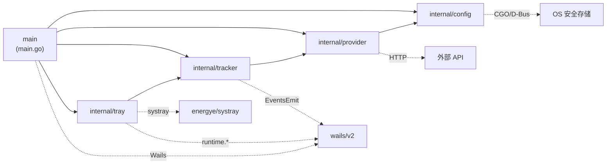

### 4.3 类图

```mermaid
classDiagram
    direction TB

    class Store {
        <<interface>>
        +Get(key string) (string, error)
        +Set(key string, value string) error
        +Delete(key string) error
        +Exists(key string) (bool, error)
        +Keys() ([]string, error)
    }

    class keychainStore {
        -service: "codebar"
        +Get(key) (string, error)
        +Set(key, value) error
        +Delete(key) error
        +Exists(key) (bool, error)
        +Keys() ([]string, error)
    }

    class libsecretStore {
        -conn: *dbus.Conn
        +Get(key) (string, error)
        +Set(key, value) error
        +Delete(key) error
        +Exists(key) (bool, error)
        +Keys() ([]string, error)
    }

    class dpapiStore {
        +Get(key) (string, error)
        +Set(key, value) error
        +Delete(key) error
        +Exists(key) (bool, error)
        +Keys() ([]string, error)
    }

    class fileStore {
        -path: string
        -read() (map[string]string, error)
        -write(m map[string]string) error
        +Get(key) (string, error)
        +Set(key, value) error
        +Delete(key) error
        +Exists(key) (bool, error)
        +Keys() ([]string, error)
    }

    Store <|.. keychainStore : macOS
    Store <|.. libsecretStore : Linux
    Store <|.. dpapiStore : Windows
    Store <|.. fileStore : 回退

    libsecretStore --> fileStore : delegates (MVP)
    dpapiStore --> fileStore : delegates (MVP)

    class PlatformProvider {
        <<interface>>
        +Name() string
        +Icon() string
        +IsConfigured() bool
        +FetchUsage() (*Usage, error)
        +ValidateConfig() error
    }

    class Usage {
        +PlatformName: string
        +PlanType: string
        +Items: []UsageItem
        +ExtraInfo: []ExtraInfoKV
    }

    class UsageItem {
        +Key: string
        +Label: string
        +Used: float64
        +Total: float64
        +Unit: string
        +ResetDate: time.Time
    }

    class ExtraInfoKV {
        +Label: string
        +Value: string
    }

    class ZenMuxProvider {
        -store: config.Store
        +SetStore(s Store)
        +Name() string
        +Icon() string
        +IsConfigured() bool
        +FetchUsage() (*Usage, error)
        +ValidateConfig() error
    }

    class BailianProvider {
        -store: config.Store
        +SetStore(s Store)
        +Name() string
        +Icon() string
        +IsConfigured() bool
        +FetchUsage() (*Usage, error)
        +ValidateConfig() error
    }

    class ClaudeProvider {
        -store: config.Store
        +SetStore(s Store)
    }

    class CopilotProvider {
        -store: config.Store
        +SetStore(s Store)
    }

    class GeminiProvider {
        -store: config.Store
        +SetStore(s Store)
    }

    class AmpProvider {
        -store: config.Store
        +SetStore(s Store)
    }

    PlatformProvider <|.. ZenMuxProvider
    PlatformProvider <|.. BailianProvider
    PlatformProvider <|.. ClaudeProvider
    PlatformProvider <|.. CopilotProvider
    PlatformProvider <|.. GeminiProvider
    PlatformProvider <|.. AmpProvider

    PlatformProvider ..> Usage : returns
    Usage *-- UsageItem
    Usage *-- ExtraInfoKV

    ZenMuxProvider --> Store : uses
    BailianProvider --> Store : uses
    ClaudeProvider --> Store : uses

    class UsageSnapshot {
        +PlatformName: string
        +PlanType: string
        +Items: []UsageItem
        +ExtraInfo: []ExtraInfoKV
        +Error: string
    }

    class Tracker {
        -providers: []PlatformProvider
        -cachePath: string
        -ctx: context.Context
        -mu: sync.RWMutex
        -cache: map[string]UsageSnapshot
        -stopCh: chan struct{}
        +Start(ctx context.Context)
        +Stop()
        +Snapshot() map[string]UsageSnapshot
        +Refresh()
        -loop()
        -refresh()
        -emitAll()
        -fetchOne(p PlatformProvider) UsageSnapshot
        -emit(name string, snap UsageSnapshot)
        -loadCache()
        -persistCache()
    }

    Tracker --> PlatformProvider : aggregates
    Tracker ..> UsageSnapshot : produces

    class Tray {
        -ctx: context.Context
        -tracker: *Tracker
        -mu: sync.RWMutex
        -label: string
        +Start(ctx context.Context)
        +Stop()
        +UpdateLabel(text string)
        -onReady()
        -onExit()
    }

    Tray --> Tracker : references

    class App {
        -ctx: context.Context
        -tracker: *Tracker
        -store: config.Store
        +GetSnapshot() map[string]UsageSnapshot
        +Configure(key, value string) error
        +GetCredential(key string) (string, error)
        +DeleteCredential(key string) error
        +ListKnownProviders() []map[string]string
        +ValidateProvider(name string) error
        +RefreshNow()
    }

    App --> Tracker : owns
    App --> Store : uses
```

### 4.4 序列图 — 启动流程

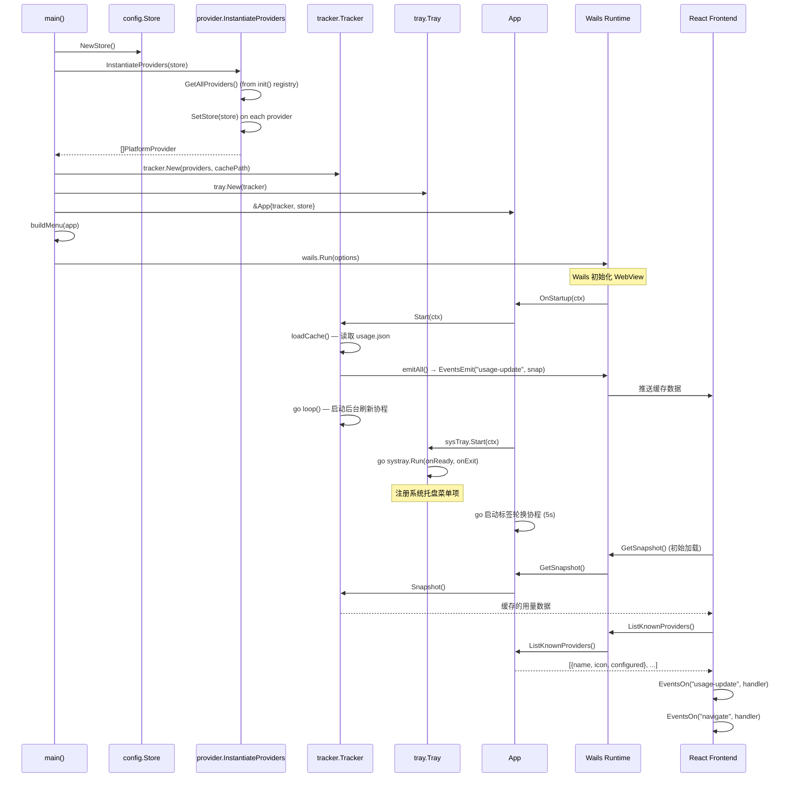

### 4.5 序列图 — 数据刷新流程

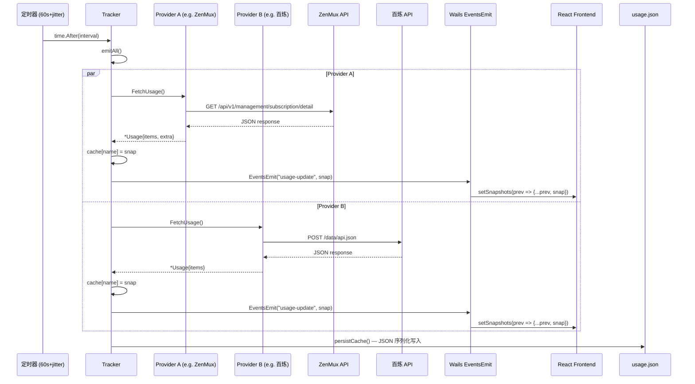

### 4.6 序列图 — 凭据配置流程

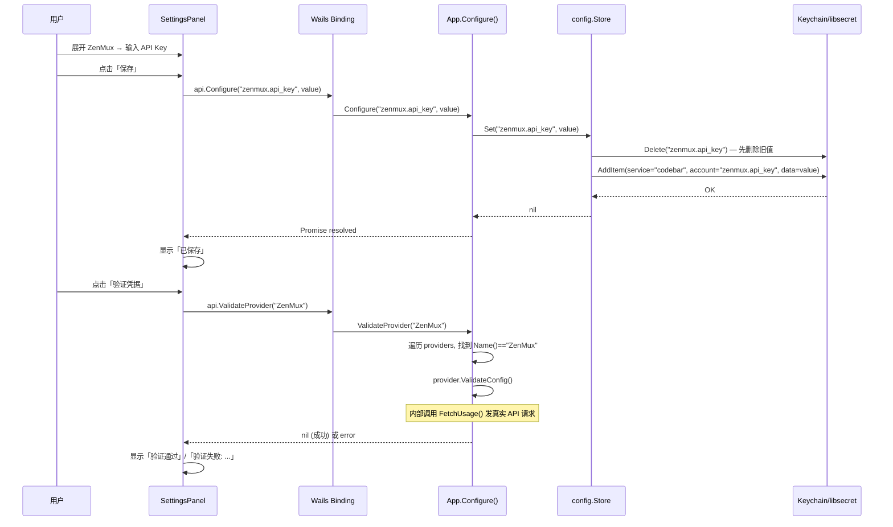

### 4.7 序列图 — 重复实例检测

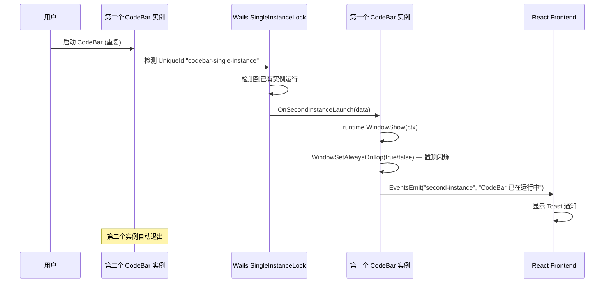

### 4.8 状态图 — 应用生命周期

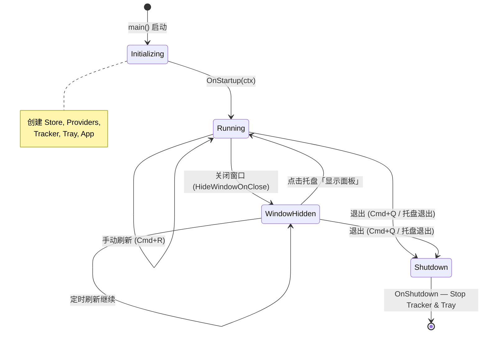

### 4.9 状态图 — Tracker 刷新状态

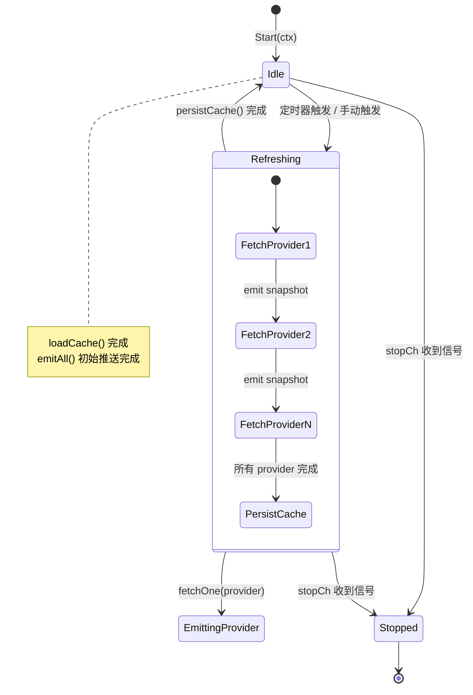

### 4.10 活动图 — Provider FetchUsage

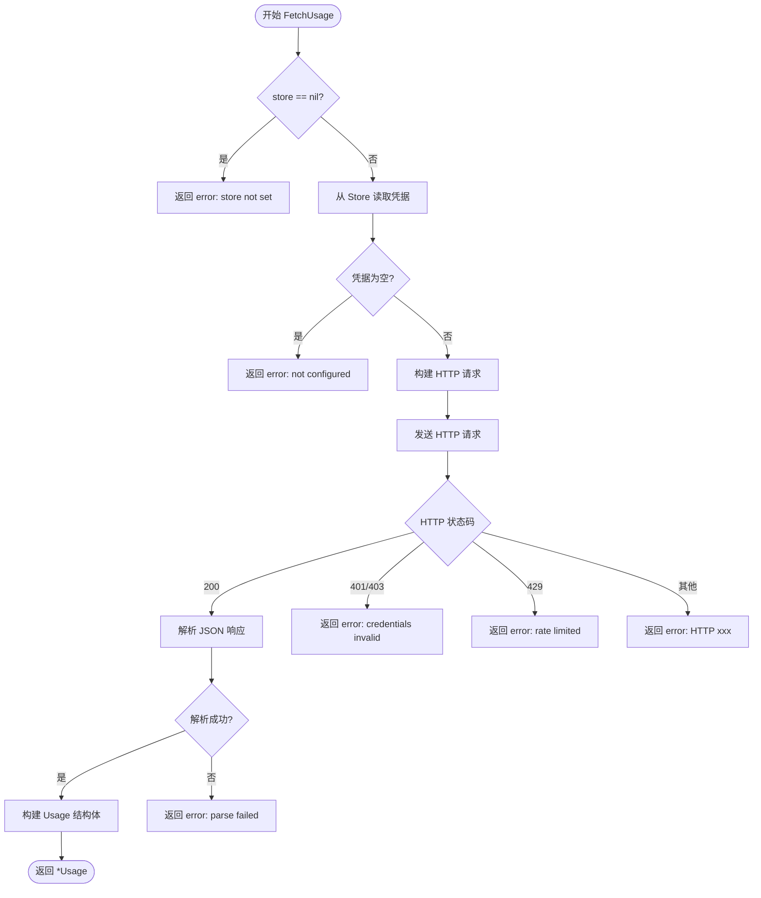

### 4.11 组件图 — 前端 React 组件

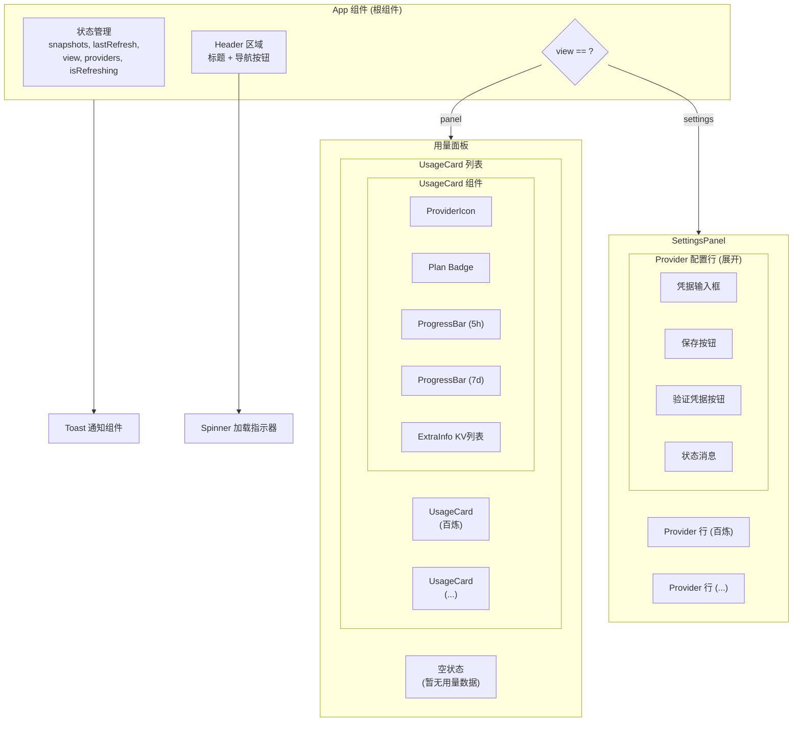

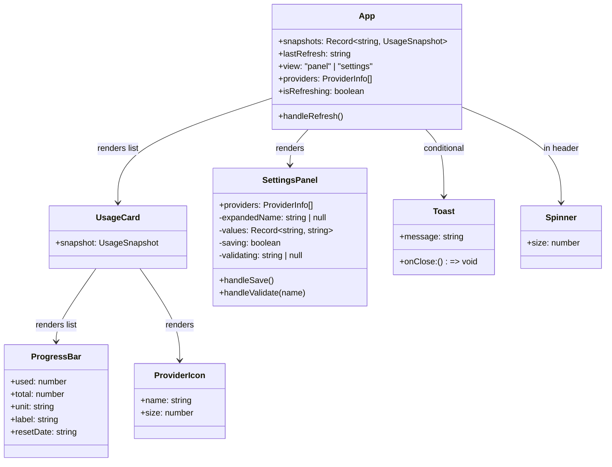

### 4.12 部署图

```mermaid
graph TB
    subgraph macOS["macOS"]
        APP_MAC["CodeBar.app<br/>(单一二进制 ~9MB)"]
        KC["macOS Keychain"]
        TRAY_MAC["Menu Bar"]
        CACHE_MAC["~/Library/Caches/codebar/usage.json"]
        APP_MAC --> KC
        APP_MAC --> TRAY_MAC
        APP_MAC --> CACHE_MAC
    end

    subgraph Linux["Linux"]
        APP_LINUX["codebar 二进制"]
        LS["libsecret (D-Bus) / 加密文件"]
        TRAY_LINUX["System Tray (DE 依赖)"]
        CACHE_LINUX["~/.cache/codebar/usage.json"]
        APP_LINUX --> LS
        APP_LINUX --> TRAY_LINUX
        APP_LINUX --> CACHE_LINUX
    end

    subgraph Windows["Windows"]
        APP_WIN["CodeBar.exe"]
        DPAPI["DPAPI / 加密文件"]
        TRAY_WIN["System Tray (原生)"]
        CACHE_WIN["%LOCALAPPDATA%/codebar/usage.json"]
        APP_WIN --> DPAPI
        APP_WIN --> TRAY_WIN
        APP_WIN --> CACHE_WIN
    end

    subgraph Cloud["外部 AI API"]
        API["ZenMux / Claude / Copilot<br/>Gemini / 百炼 / ..."]
    end

    APP_MAC -->|"HTTPS"| API
    APP_LINUX -->|"HTTPS"| API
    APP_WIN -->|"HTTPS"| API
```

### 4.13 数据流图

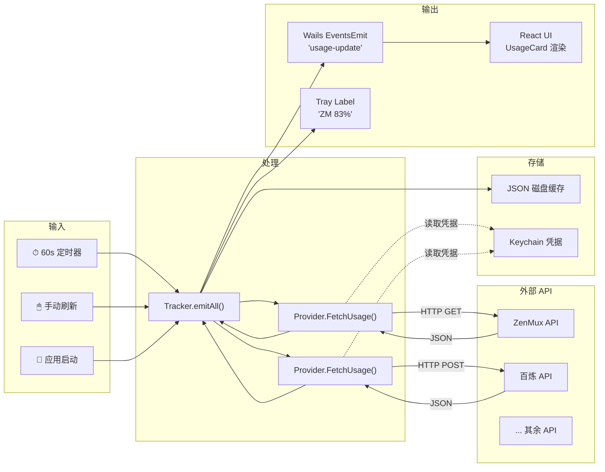

---

## 5. 核心模块详解

### 5.1 Provider 系统

#### 注册模式

采用 Go `init()` 函数自注册模式。每个 provider 文件在 `init()` 中调用 `RegisterProvider()` 将自身加入全局注册表：

```go
// zenmux.go
func init() { RegisterProvider(&ZenMuxProvider{}) }
```

这意味着**添加新 provider 只需创建一个 .go 文件**，无需修改其他代码。

#### SetStore 注入

Provider 通过实现可选的 `SetStore(config.Store)` 方法接收凭据存储实例。`InstantiateProviders()` 在启动时通过类型断言注入：

```go
func InstantiateProviders(store config.Store) []PlatformProvider {
    for _, p := range GetAllProviders() {
        if s, ok := p.(interface{ SetStore(config.Store) }); ok {
            s.SetStore(store)
        }
    }
}
```

#### HTTP 辅助

`http.go` 提供 `NewHTTPClient()` (30s 超时) 和 `doRequest()` 函数，统一处理 HTTP 状态码：
- **200/201**: 返回 body
- **401/403**: 返回 "credentials invalid" 错误
- **429**: 返回 "rate limited" 错误
- **其他**: 返回 "HTTP xxx" 错误

#### Provider 实现分类

| 类型 | Provider | 特点 |
|------|----------|------|
| **完整实现** | ZenMux, 百炼 | 真实 API 调用，完整的 JSON 解析，多个 UsageItem |
| **标准模板** | Claude, Copilot, Gemini, Amp 等 | 使用 `doRequest()` 辅助函数，单一 API 端点 |
| **特殊认证** | 百炼 | Cookie + sec_token + 复杂 POST body |

### 5.2 Config Store

#### 接口设计

```go
type Store interface {
    Get(key string) (string, error)    // 未找到返回 ("", nil)
    Set(key, value string) error
    Delete(key string) error
    Exists(key string) (bool, error)
    Keys() ([]string, error)
}
```

#### 平台实现

| 平台 | 构建标签 | 实现 | 说明 |
|------|---------|------|------|
| **macOS** | `//go:build darwin` | `keychainStore` | 使用 macOS Keychain，service="codebar" |
| **Linux** | `//go:build linux` | `libsecretStore` | D-Bus Secret Service API (MVP 阶段回退到 fileStore) |
| **Windows** | `//go:build windows` | `dpapiStore` | Windows DPAPI (MVP 阶段回退到 fileStore) |
| **回退** | 通用 | `fileStore` | AES-GCM 加密的 JSON 文件 |

#### fileStore 加密

- **算法**: AES-256-GCM
- **密钥派生**: 基于 `os.UserConfigDir()` 路径的 XOR 混合 (简化版，MVP 阶段)
- **存储路径**: `{UserConfigDir}/codebar/codebar.dat`
- **格式**: `nonce || ciphertext` (GCM nonce 前缀)

#### Keychain Upsert 模式

macOS Keychain 不支持直接更新，`Set()` 使用 delete-then-add 模式：

```go
func (s keychainStore) Set(key, value string) error {
    _ = s.Delete(key)  // 忽略 not-found 错误
    return keychain.AddItem(item)
}
```

### 5.3 Tracker

#### 职责

1. **定时刷新** — 每 60 秒 ±5 秒随机抖动
2. **数据聚合** — 遍历所有 provider，调用 `FetchUsage()`
3. **事件推送** — 通过 `runtime.EventsEmit()` 推送 `"usage-update"` 事件到前端
4. **磁盘缓存** — JSON 序列化到 `{UserCacheDir}/codebar/usage.json`
5. **冷启动** — 启动时加载缓存，立即显示上次的数据

#### UsageSnapshot vs Usage

| 类型 | 包 | 用途 |
|------|-----|------|
| `provider.Usage` | `internal/provider` | Provider 返回的内部结构 |
| `tracker.UsageSnapshot` | `internal/tracker` | 序列化/传输到前端的结构，含 JSON tags 和 Error 字段 |

#### 并发安全

使用 `sync.RWMutex` 保护 `cache` map：
- `Snapshot()`: `RLock` — 读取时不阻塞
- `fetchOne()`: `Lock` — 写入单个 provider 快照
- `persistCache()`: `RLock` — 序列化时只读

### 5.4 System Tray

#### 菜单项

| 菜单项 | 快捷键 | 行为 |
|--------|--------|------|
| 显示面板 | — | `WindowShow` + `WindowSetAlwaysOnTop` 闪烁 |
| 刷新 | — | `go tracker.Refresh()` |
| 设置 | — | `WindowShow` + `EventsEmit("navigate", "settings")` |
| 退出 | — | `systray.Quit()` + `runtime.Quit()` |

#### 标签轮换

主协程启动一个 5 秒定时器，使用 `atomic.Int64` 递增索引，从 `Tracker.Snapshot()` 中取出对应 provider 的快照，格式化为 `"ZM 83%"` 形式显示在托盘标题上。

### 5.5 Wails 绑定层

`App` 结构体的公开方法自动暴露给前端 JavaScript：

| Go 方法 | 前端调用 | 说明 |
|---------|---------|------|
| `GetSnapshot()` | `api.GetSnapshot()` | 获取全部缓存快照 |
| `Configure(key, value)` | `api.Configure(k, v)` | 写入凭据 |
| `GetCredential(key)` | `api.GetCredential(k)` | 读取凭据 |
| `DeleteCredential(key)` | `api.DeleteCredential(k)` | 删除凭据 |
| `ListKnownProviders()` | `api.ListKnownProviders()` | 列出所有 provider 信息 |
| `ValidateProvider(name)` | `api.ValidateProvider(n)` | 验证 provider 凭据 |
| `RefreshNow()` | `api.RefreshNow()` | 立即触发刷新 |

#### Wails 事件

| 事件名 | 方向 | 数据 | 触发场景 |
|--------|------|------|---------|
| `usage-update` | Go → Frontend | `UsageSnapshot` | 每次 provider 刷新完成 |
| `navigate` | Go → Frontend | `"panel"` / `"settings"` | 菜单点击 / 托盘设置 |
| `second-instance` | Go → Frontend | `"CodeBar 已在运行中"` | 检测到重复实例启动 |

### 5.6 前端 (React)

#### 组件层次

```
App
├── Toast (条件渲染 — second-instance 事件)
├── Spinner (刷新按钮内)
├── Header (标题 + 导航)
│   ├── 刷新按钮
│   ├── 用量 tab
│   └── 设置 tab
├── [view === 'panel']
│   ├── 空状态 (无 snapshots)
│   └── UsageCard[] (每个 provider 一个)
│       ├── ProviderIcon (彩色圆形 + 缩写)
│       ├── ProgressBar[] (用量条，颜色自适应)
│       └── ExtraInfo[] (键值对)
└── [view === 'settings']
    └── SettingsPanel
        └── Provider 行[] (可展开)
            ├── 凭据输入框[]
            ├── 保存按钮
            └── 验证按钮
```

#### Provider 图标配置

19 个 provider 各有预定义颜色和 2 字母缩写：

```typescript
const PROVIDER_CONFIG = {
  bailian: { color: '#4F46E5', label: '百' },
  claude:  { color: '#D97706', label: 'Cl' },
  zenmux:  { color: '#10B981', label: 'ZM' },
  // ...
}
```

#### 进度条颜色逻辑

| 使用率 | 颜色 |
|--------|------|
| > 90% | 红色 (`bg-red-500`) |
| > 70% | 琥珀色 (`bg-amber-500`) |
| ≤ 70% | 靛蓝色 (`bg-indigo-500`) |

#### 重置时间格式化

`formatRelativeTime()` 将 ISO 日期转为相对时间：
- `≤ 0`: "即将重置"
- `> 0d`: "Xd Yh"
- `> 0h`: "Xh Ym"
- `> 0m`: "Xm"

---

## 6. 安全设计

### 凭据存储安全

| 层次 | 措施 |
|------|------|
| **macOS** | macOS Keychain — OS 级别加密，需用户授权访问 |
| **Linux** | Secret Service API (gnome-keyring/KWallet) — D-Bus 加密通道 |
| **Windows** | DPAPI — 与用户登录会话绑定的加密 |
| **回退** | AES-256-GCM 加密文件，密钥基于系统路径派生 |

### 网络安全

- 所有 API 请求均使用 **HTTPS**
- HTTP 客户端设置 **30 秒超时**
- 敏感凭据 (API key, OAuth token, cookie) 仅存储在安全存储中，不写入日志

### 单实例保护

通过 Wails `SingleInstanceLock` 确保只有一个实例运行，防止多实例竞争凭据存储或重复 API 调用。

---

## 7. 跨平台适配

### 编译时平台选择

使用 Go 构建标签 (`//go:build`) 实现编译时平台适配：

| 文件 | 构建标签 | 说明 |
|------|---------|------|
| `store_keychain.go` | `darwin` | macOS 专用 |
| `store_libsecret.go` | `linux` | Linux 专用 |
| `store_dpapi.go` | `windows` | Windows 专用 |
| `store_file.go` | 无 (通用) | 所有平台的回退方案 |

### macOS 特殊配置

- **LSUIElement**: `Info.plist` 中设置为 `1`，应用不显示 Dock 图标
- **TitleBarHiddenInset**: Wails Mac 选项，使用自定义标题栏
- **HideWindowOnClose**: 关闭窗口时隐藏而非退出
- **Wails 拖拽区域**: Header 区域设置 `--wails-draggable: drag`

---

## 8. Provider 一览

| # | Provider | 图标键 | 认证方式 | API 端点 | 用量指标 |
|---|----------|--------|---------|---------|---------|
| 1 | ZenMux | `zenmux` | API Key (Bearer) | `zenmux.ai/api/v1/management/subscription/detail` | flows (5h/7d), 价格, 套餐 |
| 2 | 阿里云百炼 | `bailian` | Cookie + sec_token | `bailian-cs.console.aliyun.com/data/api.json` | tokens (月/5h/周) |
| 3 | Claude | `claude` | OAuth Token | `api.anthropic.com/v1/usage` | 5h/7d tokens, Opus利用率 |
| 4 | GitHub Copilot | `copilot` | API Key | `api.github.com/copilot_internal/usage` | requests |
| 5 | Gemini | `gemini` | API Key | `generativelanguage.googleapis.com/v1beta/usage` | requests/day |
| 6 | Amp | `amp` | API Key | `api.amp.com/v1/usage` | credits |
| 7 | Antigravity | `antigravity` | API Key | `api.antigravity.ai/v1/usage` | quota |
| 8 | Codex | `codex` | API Key | `api.codex.com/v1/usage` | credits |
| 9 | Cursor | `cursor` | API Key | `api.cursor.com/v1/usage` | credits |
| 10 | Factory | `factory` | API Key | `api.factory.ai/v1/usage` | requests |
| 11 | JetBrains AI | `jetbrains` | Token | `api.jetbrains.com/ai/v1/usage` | usage |
| 12 | Kimi | `kimi` | API Key | `api.kimi.ai/v1/usage` | quota |
| 13 | Kiro | `kiro` | API Key | `api.kiro.dev/v1/usage` | credits |
| 14 | MiniMax | `minimax` | API Key | `api.minimax.chat/v1/usage` | tokens |
| 15 | OpenCode | `opencode` | API Key | `api.opencode.ai/v1/usage` | credits |
| 16 | Perplexity | `perplexity` | API Key | `api.perplexity.ai/v1/usage` | queries |
| 17 | Synthetic | `synthetic` | API Key | `api.synthetic.com/v1/usage` | credits |
| 18 | Windsurf | `windsurf` | API Key | `api.windsurf.com/v1/usage` | credits |
| 19 | Z.ai | `zai` | API Key | `api.z.ai/v1/usage` | credits |

---

## 9. API 参考

### Go → Frontend 绑定 (Wails)

```typescript
// 自动生成: frontend/src/wailsjs/go/main/App.d.ts

// 获取所有 provider 的缓存快照
function GetSnapshot(): Promise<Record<string, tracker.UsageSnapshot>>

// 配置凭据 (key 格式: "provider.field", 如 "zenmux.api_key")
function Configure(key: string, value: string): Promise<void>

// 读取单个凭据
function GetCredential(key: string): Promise<string>

// 删除凭据
function DeleteCredential(key: string): Promise<void>

// 获取所有已知 provider 的信息
function ListKnownProviders(): Promise<Array<{name: string, icon: string, configured: string}>>

// 验证 provider 的凭据是否有效
function ValidateProvider(name: string): Promise<void>

// 立即触发一次全量刷新
function RefreshNow(): Promise<void>
```

### 数据模型 (TypeScript)

```typescript
// frontend/src/wailsjs/go/models.ts

interface UsageItem {
  key: string       // 唯一标识，如 "5hour", "7day"
  label: string     // 显示名称，如 "5小时"
  used: number      // 已使用量
  total: number     // 总配额
  unit: string      // 单位，如 "flows", "tokens"
  resetDate?: string // ISO 8601 重置时间
}

interface ExtraInfoKV {
  label: string     // 显示标签
  value: string     // 显示值
}

interface UsageSnapshot {
  platformName: string      // Provider 名称
  planType: string          // 套餐类型
  items: UsageItem[]        // 用量条目
  extraInfo?: ExtraInfoKV[] // 附加信息
  error?: string            // 错误信息
}
```

### Wails 事件

```typescript
import { EventsOn } from './wailsjs/runtime/runtime'

// 用量更新 — 每次单个 provider 刷新完成时触发
EventsOn('usage-update', (snap: UsageSnapshot) => { ... })

// 导航事件 — 从菜单/托盘触发视图切换
EventsOn('navigate', (target: 'panel' | 'settings') => { ... })

// 重复实例 — 检测到第二个实例启动时触发
EventsOn('second-instance', (message: string) => { ... })
```

---

## 10. 构建与运行

### 依赖安装

```bash
# Go 依赖
go mod download

# 前端依赖
cd frontend && npm install
```

### 开发模式

```bash
wails dev
```

### 生产构建

```bash
wails build
```

构建产物:
- **macOS**: `build/bin/CodeBar.app` (~9MB arm64)
- **Linux**: `build/bin/CodeBar`
- **Windows**: `build/bin/CodeBar.exe`

### 测试

```bash
# Go 单元测试
go test ./...

# ZenMux 集成测试 (需要真实 API Key)
ZENMUX_API_KEY=sk-... go test ./internal/provider/ -run TestZenMux -v

# 前端类型检查
cd frontend && npx tsc -b

# 代码检查
go vet ./...
```

---

## 附录: 设计决策

| 决策 | 选择 | 原因 |
|------|------|------|
| 桌面框架 | Wails v2 | 比 Electron 轻量 (9MB vs 100MB+), Go 原生集成 |
| Provider 注册 | `init()` 自注册 | 零耦合，新 provider 只需一个文件 |
| 凭据存储 | 平台原生 + 加密文件回退 | 安全优先，回退保证所有平台可用 |
| 前端 | React + Tailwind | 社区生态丰富，Wails 默认支持 |
| 定时策略 | 60s + ±5s 抖动 | 避免固定间隔导致的 API 限流 |
| 窗口关闭 | HideWindowOnClose | 托盘应用的标准行为 |
| Dock 图标 | LSUIElement=1 | 纯菜单栏应用，不占 Dock 空间 |
