# CodeBar UML 图集

> 所有图表使用 Mermaid 语法，可在 GitHub、VS Code (Mermaid 插件) 或 mermaid.live 中渲染。

---

## 1. 系统上下文图 (C4 Level 1)

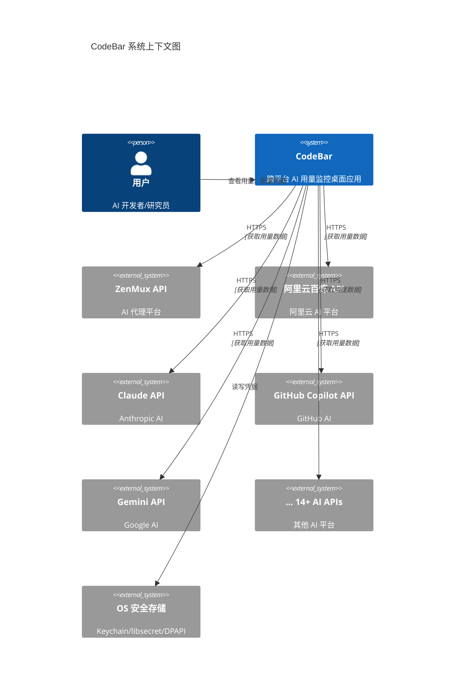

## 2. 容器图 (C4 Level 2)

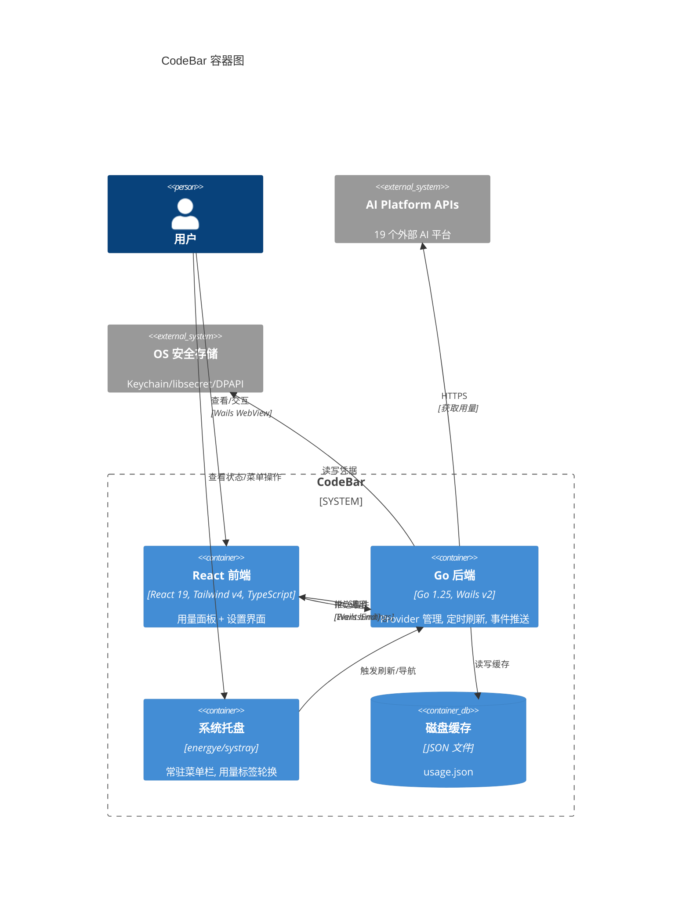

## 3. 完整类图

```mermaid
classDiagram
    direction TB

    %% === config 包 ===
    namespace config {
        class Store {
            <<interface>>
            +Get(key string) (string, error)
            +Set(key string, value string) error
            +Delete(key string) error
            +Exists(key string) (bool, error)
            +Keys() ([]string, error)
        }

        class keychainStore {
            +Get(key) (string, error)
            +Set(key, value) error
            +Delete(key) error
            +Exists(key) (bool, error)
            +Keys() ([]string, error)
        }

        class libsecretStore {
            -conn *dbus.Conn
        }

        class dpapiStore {
        }

        class fileStore {
            -path string
            -read() (map~string string~, error)
            -write(m map~string string~) error
            -encrypt(plain []byte) ([]byte, error)
            -decrypt(data []byte) ([]byte, error)
            -deriveKey() []byte
        }
    }

    Store <|.. keychainStore
    Store <|.. libsecretStore
    Store <|.. dpapiStore
    Store <|.. fileStore
    libsecretStore ..> fileStore : 回退
    dpapiStore ..> fileStore : 回退

    %% === provider 包 ===
    namespace provider {
        class PlatformProvider {
            <<interface>>
            +Name() string
            +Icon() string
            +IsConfigured() bool
            +FetchUsage() (*Usage, error)
            +ValidateConfig() error
        }

        class Usage {
            +PlatformName string
            +PlanType string
            +Items []UsageItem
            +ExtraInfo []ExtraInfoKV
        }

        class UsageItem {
            +Key string
            +Label string
            +Used float64
            +Total float64
            +Unit string
            +ResetDate time.Time
        }

        class ExtraInfoKV {
            +Label string
            +Value string
        }

        class ZenMuxProvider {
            -store Store
            +SetStore(s Store)
        }

        class BailianProvider {
            -store Store
            +SetStore(s Store)
        }

        class ClaudeProvider {
            -store Store
            +SetStore(s Store)
        }

        class CopilotProvider {
            -store Store
            +SetStore(s Store)
        }

        class GeminiProvider {
            -store Store
            +SetStore(s Store)
        }

        class AmpProvider {
            -store Store
            +SetStore(s Store)
        }

        class AntigravityProvider {
            -store Store
        }

        class CodexProvider {
            -store Store
        }

        class CursorProvider {
            -store Store
        }

        class FactoryProvider {
            -store Store
        }

        class JetBrainsProvider {
            -store Store
        }

        class KimiProvider {
            -store Store
        }

        class KiroProvider {
            -store Store
        }

        class MinimaxProvider {
            -store Store
        }

        class OpenCodeProvider {
            -store Store
        }

        class PerplexityProvider {
            -store Store
        }

        class SyntheticProvider {
            -store Store
        }

        class WindsurfProvider {
            -store Store
        }

        class ZaiProvider {
            -store Store
        }
    }

    PlatformProvider <|.. ZenMuxProvider
    PlatformProvider <|.. BailianProvider
    PlatformProvider <|.. ClaudeProvider
    PlatformProvider <|.. CopilotProvider
    PlatformProvider <|.. GeminiProvider
    PlatformProvider <|.. AmpProvider
    PlatformProvider <|.. AntigravityProvider
    PlatformProvider <|.. CodexProvider
    PlatformProvider <|.. CursorProvider
    PlatformProvider <|.. FactoryProvider
    PlatformProvider <|.. JetBrainsProvider
    PlatformProvider <|.. KimiProvider
    PlatformProvider <|.. KiroProvider
    PlatformProvider <|.. MinimaxProvider
    PlatformProvider <|.. OpenCodeProvider
    PlatformProvider <|.. PerplexityProvider
    PlatformProvider <|.. SyntheticProvider
    PlatformProvider <|.. WindsurfProvider
    PlatformProvider <|.. ZaiProvider

    PlatformProvider ..> Usage : returns
    Usage *-- UsageItem
    Usage *-- ExtraInfoKV
    ZenMuxProvider --> Store : uses
    BailianProvider --> Store : uses

    %% === tracker 包 ===
    namespace tracker {
        class Tracker {
            -providers []PlatformProvider
            -cachePath string
            -ctx context.Context
            -mu sync.RWMutex
            -cache map~string UsageSnapshot~
            -stopCh chan struct{}
            +New(providers, cachePath) *Tracker
            +Start(ctx context.Context)
            +Stop()
            +Snapshot() map~string UsageSnapshot~
            +Refresh()
            -loop()
            -emitAll()
            -fetchOne(p) UsageSnapshot
            -emit(name, snap)
            -loadCache()
            -persistCache()
        }

        class UsageSnapshot {
            +PlatformName string
            +PlanType string
            +Items []UsageItem
            +ExtraInfo []ExtraInfoKV
            +Error string
        }
    }

    Tracker o-- PlatformProvider : aggregates
    Tracker ..> UsageSnapshot : produces

    %% === tray 包 ===
    namespace tray {
        class Tray {
            -ctx context.Context
            -tracker *Tracker
            -mu sync.RWMutex
            -label string
            +New(tr *Tracker) *Tray
            +Start(ctx context.Context)
            +Stop()
            +UpdateLabel(text string)
            -onReady()
            -onExit()
        }
    }

    Tray --> Tracker : references

    %% === main 包 ===
    namespace main {
        class App {
            -ctx context.Context
            -tracker *Tracker
            -store Store
            +GetSnapshot() map~string UsageSnapshot~
            +Configure(key, value) error
            +GetCredential(key) (string, error)
            +DeleteCredential(key) error
            +ListKnownProviders() []map~string string~
            +ValidateProvider(name) error
            +RefreshNow()
        }
    }

    App --> Tracker : owns
    App --> Store : uses
```

## 4. 序列图 — 完整启动流程

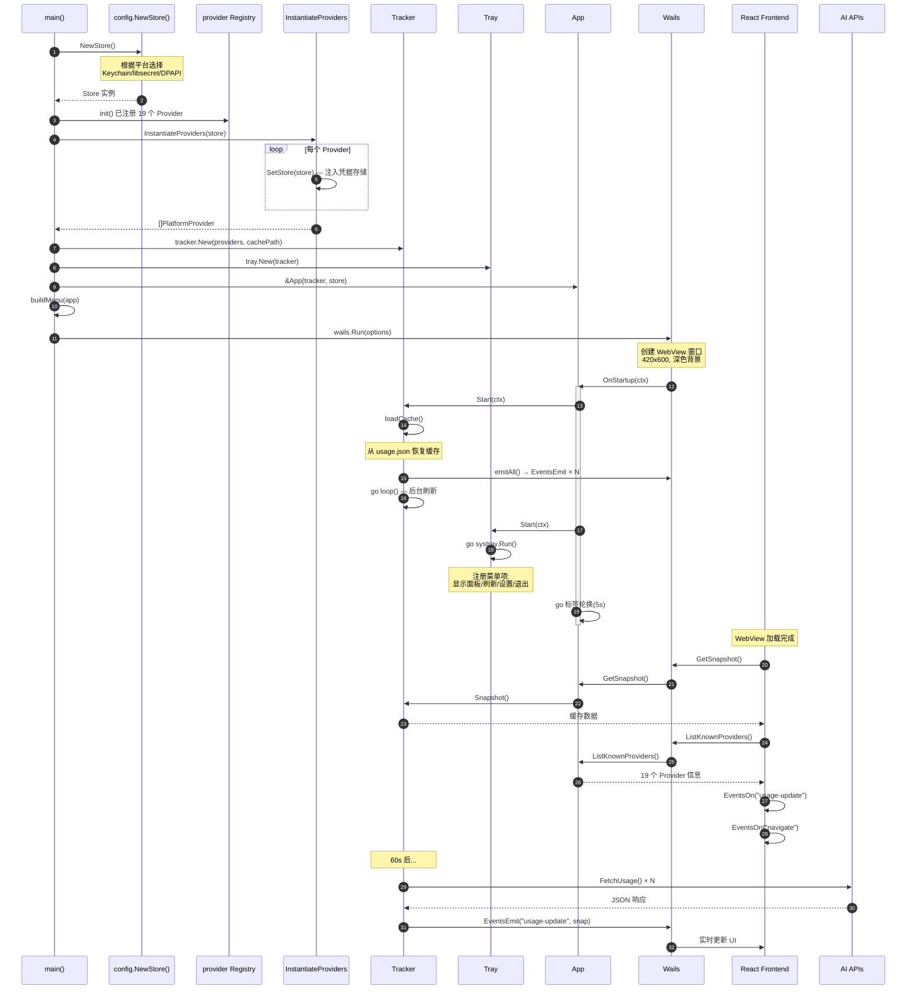

## 5. 序列图 — 手动刷新

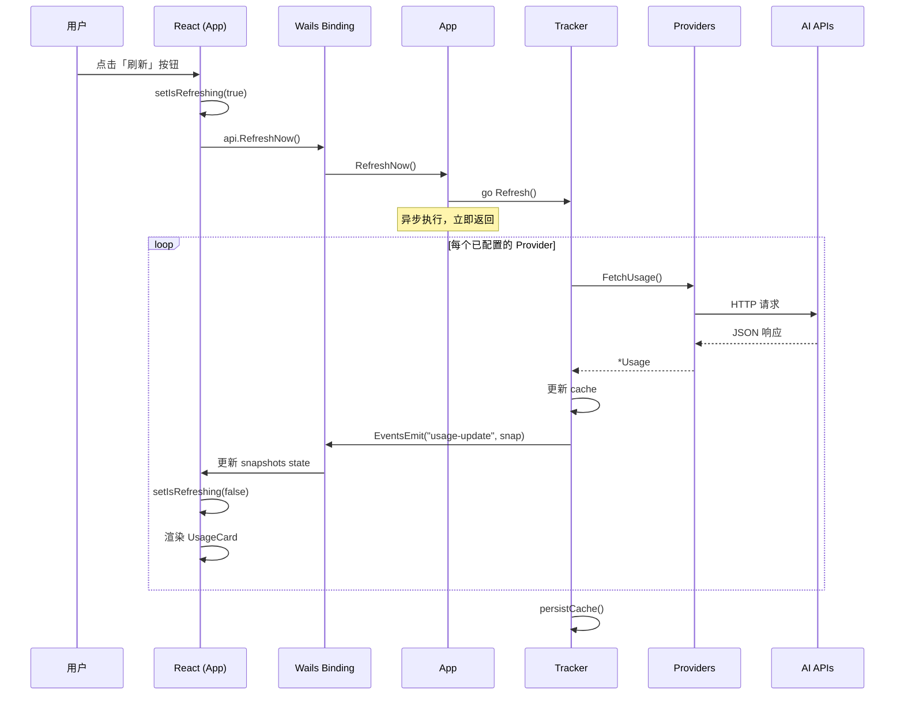

## 6. 序列图 — 凭据保存与验证

```mermaid
sequenceDiagram
    participant U as 用户
    participant FE as SettingsPanel
    participant W as Wails
    participant A as App
    participant S as Store
    participant KC as Keychain
    participant P as Provider
    participant API as AI API

    rect rgb(40, 40, 60)
    Note over U,KC: 保存凭据
    U->>FE: 输入 API Key
    U->>FE: 点击「保存」
    FE->>FE: setSaving(true)

    loop 每个非空字段
        FE->>W: Configure(key, value)
        W->>A: Configure(key, value)
        A->>S: Set(key, value)
        S->>KC: Delete(key) — 删除旧值
        S->>KC: AddItem(key, value)
        KC-->>S: OK
        S-->>A: nil
    end

    A-->>FE: Promise resolved
    FE->>FE: setSaving(false)
    FE->>FE: 显示「已保存」
    end

    rect rgb(40, 60, 40)
    Note over U,API: 验证凭据
    U->>FE: 点击「验证凭据」
    FE->>FE: setValidating(name)

    FE->>W: ValidateProvider(name)
    W->>A: ValidateProvider(name)
    A->>A: 查找匹配的 Provider
    A->>P: ValidateConfig()
    P->>P: IsConfigured() → true
    P->>P: FetchUsage()
    P->>S: Get(credential_key)
    S->>KC: QueryItem(key)
    KC-->>S: credential_value
    P->>API: HTTP 请求 (with credential)

    alt 成功
        API-->>P: 200 OK + data
        P-->>A: nil
        A-->>FE: Promise resolved
        FE->>FE: 显示「验证通过」(绿色)
    else 失败
        API-->>P: 401/403
        P-->>A: error("credentials invalid")
        A-->>FE: Promise rejected
        FE->>FE: 显示错误消息 (红色)
    end

    FE->>FE: setValidating(null)
    end
```

## 7. 序列图 — 系统托盘交互

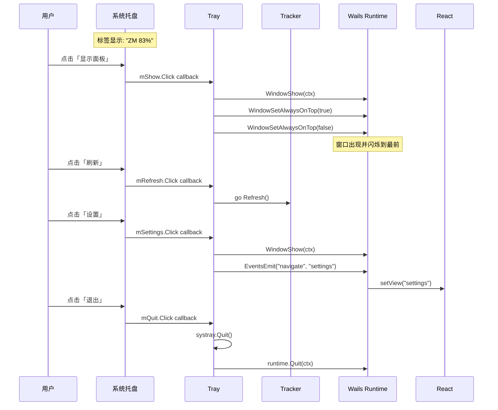

## 8. 序列图 — 重复实例检测

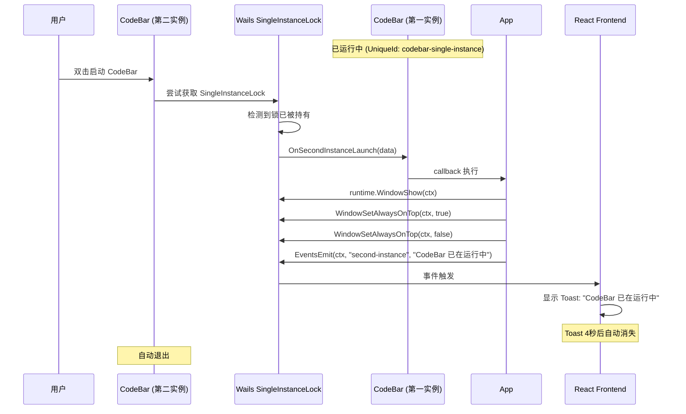

## 9. 状态图 — 应用完整生命周期

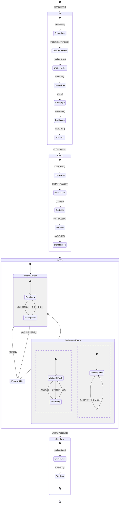

## 10. 状态图 — Provider 请求状态

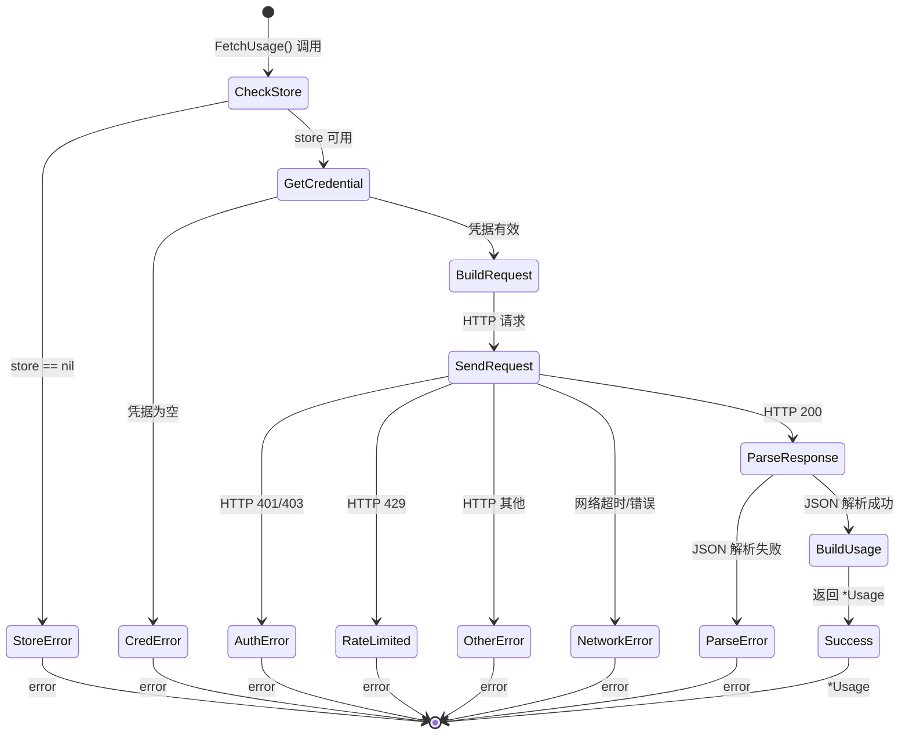

## 11. 活动图 — Tracker emitAll 流程

```mermaid
flowchart TD
    START([emitAll 开始]) --> LOOP{还有 Provider?}
    LOOP -->|是| CHECK[p.IsConfigured()?]
    CHECK -->|未配置| SKIP[UsageSnapshot{Error: not configured}]
    CHECK -->|已配置| FETCH[p.FetchUsage()]
    FETCH --> RESULT{成功?}
    RESULT -->|是| SNAP[构建 UsageSnapshot]
    RESULT -->|否| ERR_SNAP[UsageSnapshot{Error: err.Error()}]
    SNAP --> LOCK[mu.Lock() 写入 cache]
    ERR_SNAP --> EMIT_ERR[emit error snapshot]
    SKIP --> EMIT_SKIP[emit not-configured snapshot]
    LOCK --> UNLOCK[mu.Unlock()]
    UNLOCK --> EMIT[EventsEmit 'usage-update']
    EMIT --> LOOP
    EMIT_ERR --> LOOP
    EMIT_SKIP --> LOOP
    LOOP -->|否| PERSIST[persistCache()]
    PERSIST --> RLOCK[mu.RLock()]
    RLOCK --> MARSHAL[json.Marshal(cache)]
    MARSHAL --> WRITEFILE[os.WriteFile(cachePath)]
    WRITEFILE --> RUNLOCK[mu.RUnlock()]
    RUNLOCK --> END([emitAll 完成])
```

## 12. 组件图 — 前端组件树

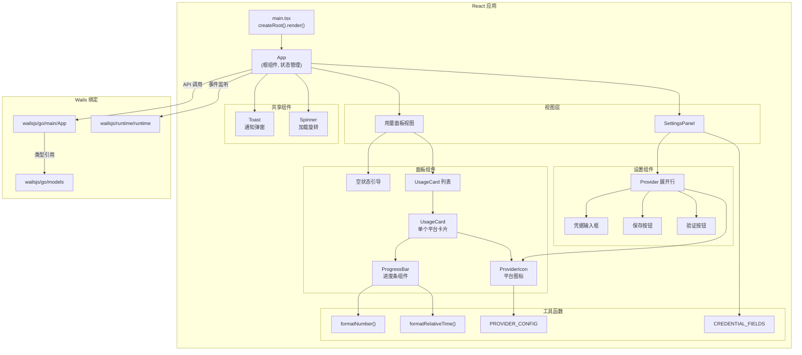

## 13. ER 图 — 数据模型关系

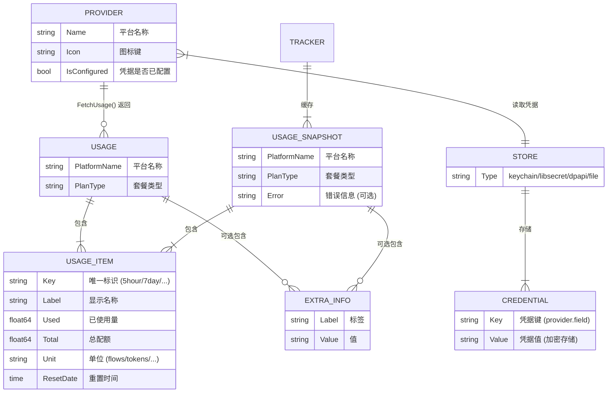

## 14. 网络拓扑图 — API 通信

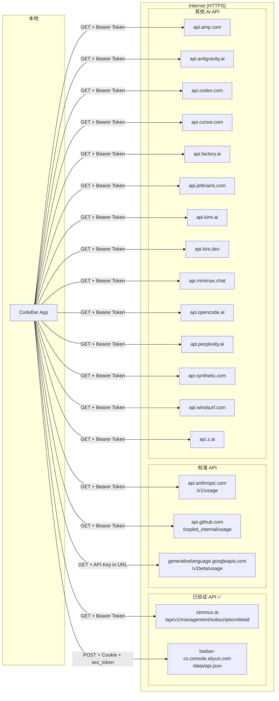

## 15. 用户旅程图

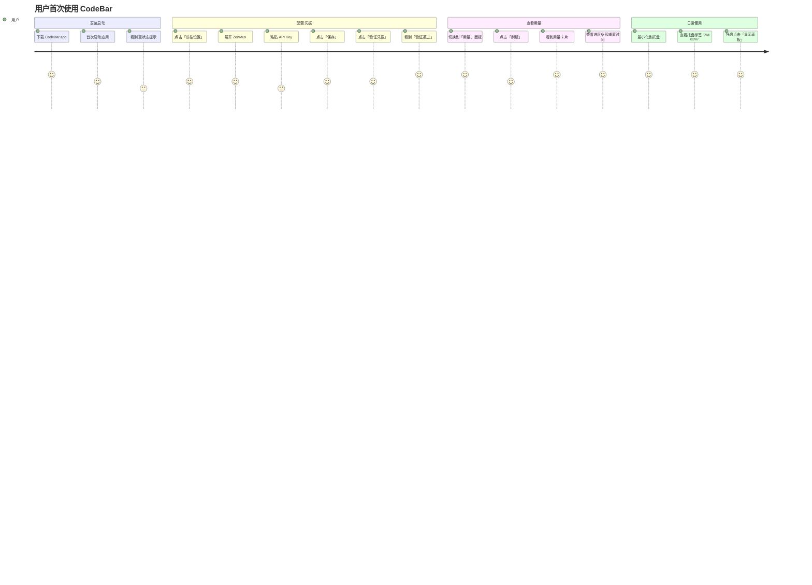

## 16. 甘特图 — 启动时间线

```mermaid
gantt
    title CodeBar 启动时间线
    dateFormat X
    axisFormat %Lms

    section 初始化
    NewStore()                  :done, 0, 5
    InstantiateProviders()      :done, 5, 15
    tracker.New()               :done, 15, 18
    tray.New()                  :done, 18, 20
    buildMenu()                 :done, 20, 22

    section Wails 启动
    wails.Run() — WebView 初始化  :active, 22, 100

    section OnStartup
    loadCache()                  :done, 100, 110
    emitAll() — 推送缓存          :done, 110, 120
    go loop() — 后台刷新          :milestone, 120, 120
    sysTray.Start()              :done, 120, 140
    go 标签轮换                   :milestone, 140, 140

    section 前端加载
    React 渲染                   :active, 100, 200
    GetSnapshot()                :done, 200, 210
    ListKnownProviders()         :done, 210, 215
    EventsOn 注册                :done, 215, 220
    UI 就绪                      :milestone, 220, 220

    section 首次刷新
    等待 60s                     :crit, 220, 6220
    emitAll() — 真实 API 调用     :active, 6220, 8220
```
