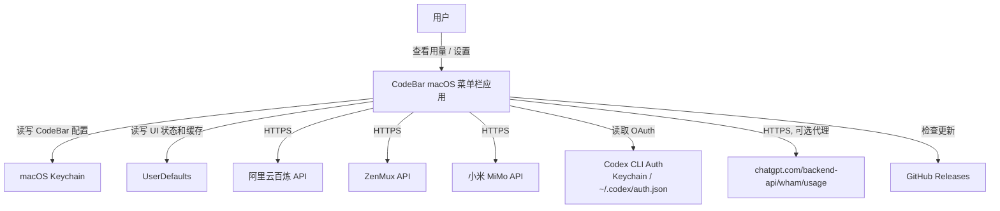
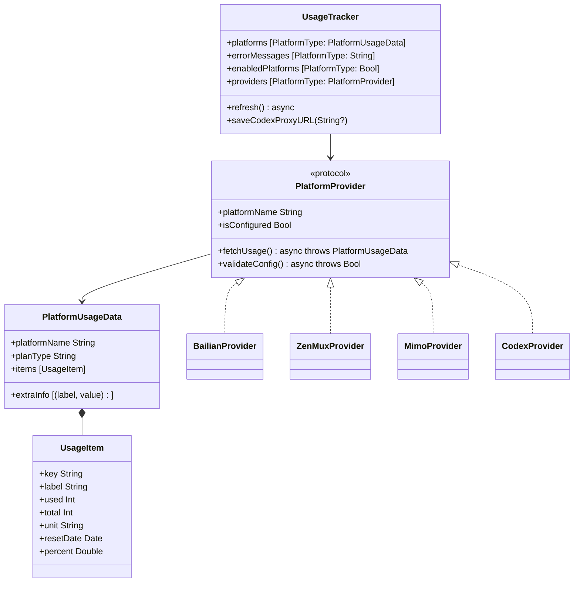
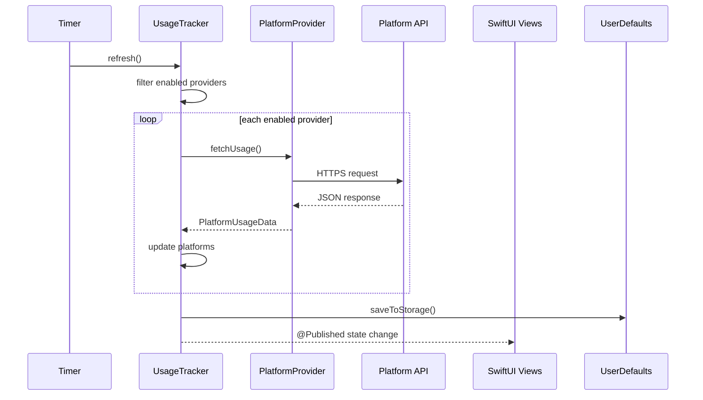
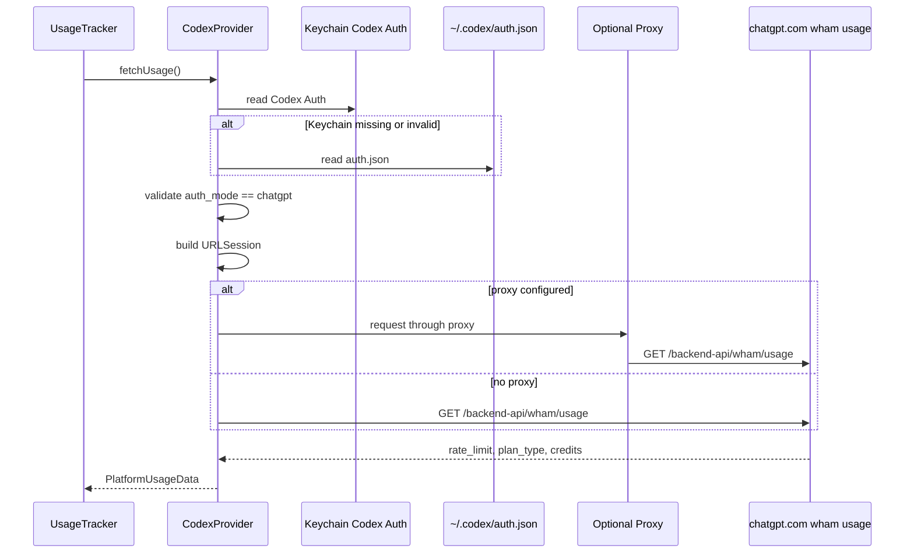
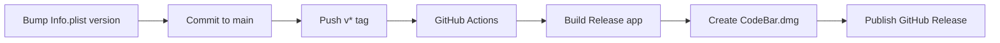

# CodeBar UML 图集

以下图表使用 Mermaid 语法，可在 GitHub 或 VS Code Mermaid 插件中渲染。

## 系统上下文



## 组件图

```mermaid
flowchart LR
    App["CodeBarApp"]
    Tracker["UsageTracker"]
    Menu["MenuBarView"]
    Settings["SettingsWindow"]
    KeychainHelper["KeychainHelper"]
    UpdateChecker["UpdateChecker"]

    subgraph Providers
        PlatformProvider["PlatformProvider"]
        BailianProvider["BailianProvider"]
        ZenMuxProvider["ZenMuxProvider"]
        MimoProvider["MimoProvider"]
        CodexProvider["CodexProvider"]
    end

    App --> Tracker
    App --> Menu
    App --> Settings
    App --> UpdateChecker
    Menu --> Tracker
    Settings --> Tracker
    Tracker --> PlatformProvider
    Tracker --> KeychainHelper
    PlatformProvider <|-- BailianProvider
    PlatformProvider <|-- ZenMuxProvider
    PlatformProvider <|-- MimoProvider
    PlatformProvider <|-- CodexProvider
```

## Provider 类图



## 刷新时序



## Codex 查询时序



## 发布流程


